# Mapa do fluxo do projeto Fato ou Fake

Este documento consolida o pipeline do projeto em um diagrama Mermaid e acompanha a explicação detalhada de cada etapa do fluxo. O objetivo é servir como base de conhecimento para qualquer pessoa que queira entender, manter ou evoluir o sistema.

## Diagrama Mermaid

```mermaid
flowchart TD
    A["01. Validação da entrada<br/>Valida a alegação, limpa o texto,<br/>confere artigo opcional e evita inputs inválidos"] --> B["02. Preparação do plano de busca<br/>Transforma a alegação em termos,<br/>sinônimos e estratégia de consulta"]
    B --> C["03. Busca no PubMed<br/>Consulta artigos científicos relevantes<br/>com base na alegação e nos termos preparados"]
    C --> D["04. Verificação de identidade<br/>Confirma DOI, metadados e evita duplicatas<br/>ou artigos inconsistentes"]
    D --> E["05. Obtenção de conteúdo no PMC<br/>Recupera summary e texto completo<br/>do artigo selecionado"]
    E --> F["06. Chunking do texto<br/>Divide o conteúdo em trechos pequenos<br/>para facilitar análise e recuperação"]
    F --> G["07. Recuperação lexical<br/>Busca por termos e palavras-chave<br/>similares à alegação"]
    G --> H["08. Recuperação semântica<br/>Busca por significado, não só literal,<br/>usando representações vetoriais"]
    H --> I["09. Ranking híbrido<br/>Combina busca lexical + semântica<br/>para priorizar trechos mais úteis"]
    I --> J["10. Extração de evidências<br/>Converte trechos em afirmações<br/>rastreáveis e comparáveis"]
    J --> K["11. Classificação das relações<br/>Avaliamos se a evidência apoia,<br/>contraria, é inconclusiva ou conflitante"]
    K --> L["12. Síntese de evidências<br/>Agrega dados por artigo e por corpus<br/>para interpretar o conjunto de evidências"]
    L --> M["13. Validação de qualidade<br/>Avalia desenho do estudo,<br/>registro e confiabilidade do artigo"]
    M --> N["14. AMSTAR 2<br/>Avalia rigor metodológico<br/>da revisão e seu nível de confiança"]
    N --> O["15. Resposta explicável<br/>Gera conclusão clara, com justificativa,<br/>limitações, fontes e orientação humana"]
    O --> P["Relatório final para o usuário<br/>Entregue em linguagem acessível,<br/>mas com base em evidência científica"]

    classDef etapa fill:#ECF3FF,stroke:#2F5BFF,color:#122B4C,stroke-width:1.3px;
    class A,B,C,D,E,F,G,H,I,J,K,L,M,N,O,P etapa;
```

## Visão geral do fluxo

O projeto funciona como um pipeline de verificação de alegações com base em evidência científica. Ele não decide “verdadeiro ou falso” de forma arbitrária; em vez disso, organiza um processo racional: recebe uma alegação, busca artigos relevantes, identifica trechos e evidências, classifica a relação desses trechos com o tema, combina a qualidade metodológica dos estudos e então entrega uma resposta explicável ao usuário.

A lógica central do projeto é que uma conclusão só deve existir quando houver suporte documental claro e rastreável. Por isso, o sistema preserva fontes, trechos, artigos e critérios de qualidade. Isso reduz o risco de uma resposta inventada ou excessivamente confiável.

---

## 01. Validação da entrada

Essa é a etapa inicial e responde à pergunta: “a entrada do usuário está em um formato aceitável para a análise?”

Ela cobre:

- normalização da alegação textual;
- limpeza de espaços, caracteres extras e inconsistências de escrita;
- validação da presença de uma afirmação central; 
- tratamento do artigo opcional, caso o usuário forneça referência bibliográfica, DOI ou link;
- rejeição ou alertas para entradas vazias, ambíguas ou mal formadas.

Por que isso importa?

Porque se o texto de entrada estiver ruim, o resto do pipeline passa a operar sobre uma base inconsistente. O sistema sem premissas válidas corre o risco de recuperar artigos irrelevantes, gerar classificações erradas ou estruturar um relatório sem sentido.

Em resumo, essa etapa é a “porta de entrada” da qualidade do processo inteiro.

---

## 02. Preparação do plano de busca

A etapa de preparação é a tradução da alegação em um conjunto de consultas científicas bem estruturadas.

O sistema:

- identifica termos-chave relevantes;
- separa conceitos centrais da frase;
- considera variações e sinônimos;
- organiza um plano para a busca em bases como PubMed;
- gera uma estratégia de consulta que maximize a chance de recuperar artigos úteis.

É importante observar que a qualidade do plano de busca influencia diretamente a qualidade da análise. Se a busca for muito estreita, pode faltar evidência; se for muito ampla, podem surgir grandes volumes de material irrelevante.

Essa etapa transforma uma frase informal em uma query científica organizada, com foco em precisão e rastreabilidade.

---

## 03. Busca no PubMed

Aqui o sistema consulta o PubMed para localizar publicações relacionadas à alegação.

A busca normalmente envolve:

- uso dos termos preparados na etapa anterior;
- consulta à base bibliográfica do PubMed;
- coleta de metadados importantes como título, autores, DOI, resumo e identificadores;
- priorização de artigos que tenham maior chance de ser relevantes.

Esse é o primeiro grande passo para trazer evidência real para o processo. Até este ponto o sistema ainda não avaliou o conteúdo do artigo, mas já conseguiu encontrar materiais que poderiam sustentar uma resposta.

O PubMed funciona como a principal porta de entrada para a literatura científica formal, que é o centro do projeto.

---

## 04. Verificação de identidade e metadados

Depois de localizar as publicações, o sistema precisa confirmar que os artigos encontrados são os mesmos que parecem ser e que suas referências estão consistentes.

Essa etapa usa informações como:

- DOI;
- título e subtítulo;
- autores;
- dados externos de Crossref;
- comparação de metadados para evitar ambiguidades.

O objetivo é evitar:

- duplicatas indevidas;
- artigos com identidade conflituosa;
- registros que parecem estar relacionados mas não são a mesma publicação;
- casos em que a busca recuperou material com pouca consistência bibliográfica.

Sem essa validação, o sistema poderia misturar publicações diferentes e gerar conclusões baseadas em fontes confundidas.

---

## 05. Obtenção de conteúdo no PMC

Quando a identidade do artigo é validada, o sistema procura acessar o conteúdo textual. Em muitos casos, isso acontece no PubMed Central (PMC), que disponibiliza texto completo e seções estruturadas.

A etapa inclui:

- extração do resumo;
- leitura de seções relevantes do texto;
- obtenção de conteúdo científico em um formato que pode ser analisado;
- preservação da vinculação ao artigo original.

Isso é importante porque um resumo isolado nem sempre contém todos os dados relevantes. O texto completo permite que o sistema compare a alegação com afirmações específicas do estudo, e não apenas com um resumo superficial.

---

## 06. Chunking do texto

Artigos científicos são longos e densos. Para evitar problemas de processamento e permitir uma análise mais focada, o conteúdo é dividido em chunks.

Um chunk pode ser uma seção, um trecho ou uma passagem pequena do texto, organizada em partes enxutas e rastreáveis.

Essa etapa serve para:

- segmentar o texto em blocos menores;
- reduzir o ruído e facilitar a comparação;
- permitir a busca por trechos relevantes;
- manter a referência do trecho ao artigo e às seções de origem.

Sem chunking, o sistema teria dificuldade de navegar por um artigo inteiro e formular comparações específicas com a alegação.

---

## 07. Recuperação lexical

A recuperação lexical busca encontrar trechos que tenham maior coincidência textual com a alegação.

Ela procura por:

- termos-chave semelhantes;
- palavras e expressões compartilhadas;
- correspondência direta de vocabulário;
- trechos que parecem responder à pergunta do ponto de vista textual.

Essa etapa é útil porque ela identifica rapidamente as partes do artigo que mais parecem falar diretamente sobre o tema. Porém, ela tem limites: uma frase pode ter significado parecido sem usar exatamente as mesmas palavras.

Por isso, o projeto também inclui recuperação semântica.

---

## 08. Recuperação semântica

A recuperação semântica vai além das palavras. Ela tenta entender a ideia por trás da frase.

O sistema usa representações vetoriais dos textos para comparar a alegação com os trechos do artigo, mesmo quando a linguagem é diferente. Por exemplo:

- uma alegação pode dizer “aumenta o risco de doença”;
- o artigo pode dizer “associado a maior probabilidade de desfecho adverso”.

Essas frases são semanticamente próximas mesmo com vocabulário diferente.

Essa etapa adiciona inteligência ao processo e aumenta a chance de achar evidência relevante que não aparece por coincidência literal.

---

## 09. Ranking híbrido

O ranking híbrido combina a melhor parte da busca lexical com a melhor parte da busca semântica.

A ideia é simples:

- a busca lexical é forte para coincidência literal;
- a busca semântica é forte para relações conceituais;
- a combinação produz ordenação mais equilibrada e útil.

Esse ranking decide quais trechos devem ser priorizados para análise detalhada. Ele é um componente crítico porque não basta encontrar muitos documentos: é preciso encontrar os mais relevantes e úteis para a pergunta.

---

## 10. Extração de evidências

Depois de selecionar os trechos mais relevantes, o sistema transforma esses trechos em evidências estruturadas.

Em vez de lidar só com texto bruto, ele passa a trabalhar com unidades como:

- afirmação originada do artigo;
- trecho de suporte;
- relação com a alegação;
- contexto da comparação.

Essa é a etapa em que a máquina deixa de apenas “ler” e passa a “organizar” a informação em blocos comparáveis. Isso permite que o passo seguinte classifique o relacionamento entre a alegação e a evidência.

---

## 11. Classificação das relações

Agora cada evidência precisa ser classificada em relação à alegação.

O sistema tenta responder perguntas como:

- a evidência apoia a alegação?
- a evidência contradiz a alegação?
- a evidência é inconclusiva?
- há conflito entre diferentes resultados?
- a relação é ambígua ou depende do contexto?

Essa etapa não é apenas uma etiqueta. Ela também considera:

- grau de confiança da evidência;
- probabilidades de relação;
- justificativa do classificador;
- contexto em que a afirmação foi feita.

O resultado é uma avaliação mais rica do que apenas “sim” ou “não”.

---

## 12. Síntese de evidências

Após a classificação individual, o sistema agrega o conjunto de evidências.

Essa etapa responde à pergunta: “o conjunto de artigos e trechos, juntos, aponta para uma conclusão?”

Ela pode:

- reunir evidências por artigo;
- combinar evidências entre diferentes artigos;
- identificar padrões e divergências;
- destacar quando há apoio consistente, conflito ou insuficiência;
- distinguir “há evidência” de “há evidência forte e consistente”.

Essa etapa transforma a análise do nível local para o nível global. Em vez de olhar para cada trecho isolado, o sistema olha para o corpus inteiro.

---

## 13. Validação de qualidade do artigo

Não basta encontrar estudos relevantes; também é preciso avaliar quão confiáveis são esses estudos.

A validação de qualidade investiga:

- desenho do estudo;
- tipo de evidência;
- transparência metodológica;
- registro do estudo;
- validade interna e externa;
- disponibilidade de dados e replicabilidade;
- consistência do método científico.

Essa etapa ajuda a distinguir entre:

- estudo robusto;
- estudo frágil;
- estudo potencialmente enviesado.

É uma etapa essencial porque evidência fraca pode levar a conclusões falsas mesmo quando o artigo parece relevante.

---

## 14. Aplicação do AMSTAR 2

AMSTAR 2 é um instrumento usado para avaliar a qualidade metodológica de revisões sistemáticas.

O projeto usa essa abordagem para:

- verificar a robustez da revisão;
- detectar limitações metodológicas;
- saber se a revisão foi conduzida com rigor;
- contextualizar a confiabilidade da síntese.

O importante aqui é que a metodologia não é tratada como detalhe secundário. Ela determina em grande parte a confiança da resposta final. Mesmo que haja muitos artigos, se a revisão que sustenta a conclusão foi mal conduzida, a confiança deve cair.

---

## 15. Resposta explicável

Essa é a etapa final e a mais importante do ponto de vista do usuário.

O sistema gera uma resposta que, além de concluir, explica:

- qual foi a hipótese ou alegação analisada;
- qual corpo de evidência foi encontrado;
- qual foi o sentido geral das evidências;
- se a conclusão é forte, moderada ou fraca;
- quais são as limitações da análise;
- quais fontes sustentam a interpretação;
- o que ainda permanece incerto.

Em outras palavras, a resposta final não se limita a dizer “verdadeiro ou falso”. Ela transforma a análise em um relatório compreensível, transparente e rastreável.

Essa é a etapa que deixa o projeto útil para pessoas que não são especialistas em ciência e também para profissionais que querem verificar cada hipótese com rigor.

---

## Relatório final

Ao final do fluxo, o usuário recebe um relatório com:

- conclusão da evidência;
- justificativa clara e embasada;
- limitação metodológica;
- qualidade dos estudos ou revisões consultadas;
- fontes e lembretes para revisão humana.

Esse fechamento é o que diferencia o sistema de uma busca simples. Ele não apenas recupera artigos: ele organiza, interpreta, classifica e comunica a evidência de forma compreensível.

---

## Conclusão

O projeto Fato ou Fake é um pipeline completo de apoio à verificação de alegações científicas. Ele percorre desde a validação da entrada até a geração de uma resposta explicável, passando por busca, identificação, extração, classificação, síntese, avaliação de qualidade e comunicação do resultado.

A base de conhecimento deste fluxo é essencial para garantir que qualquer pessoa que participe do projeto entenda não apenas o que o sistema faz, mas também por que cada etapa existe e como ela influencia a conclusão final.
