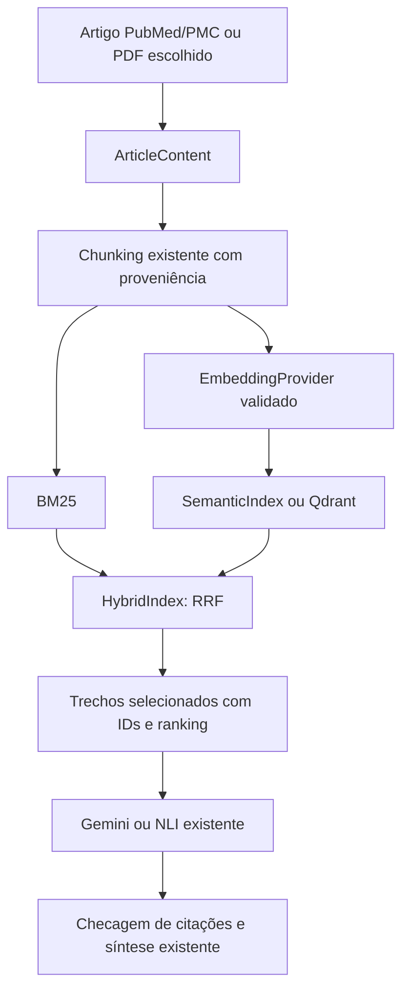

# Recuperação persistente e avaliação

## Inspeção e baseline

A inspeção deste worktree encontrou uma implementação inicial de Qdrant, cliente
em requirements.txt e seis testes. O baseline passou com 276 testes. Havia várias
alterações anteriores de biblioteca, leitura de artigos e interface; elas foram
preservadas. Nenhum conteúdo do `.env` foi lido ou alterado neste trabalho.

`create_live_retrieval_app` delega a `create_pubmed_only_app`. A web recuperava por
BM25 e só conectava RRF quando recebia Qdrant. A implementação anterior voltava
a BM25 automaticamente em falhas. `ScientificArticleProcessor`, outro caminho
do projeto, já usava `SemanticIndex` + `HybridIndex` em memória. Ele conserva esse
comportamento e recebe opcionalmente um `ChunkIndexFactory`.

## Contratos e fluxo



`EmbeddingEncoder` conserva compatibilidade com os encoders antigos.
`EmbeddingProvider` explicita modelo, dimensão e encode. O adaptador validado
aprende a dimensão após carregar o modelo, confere o modelo e valida quantidade,
dimensões, finitude e vetores não nulos. Não muda de modelo em caso de erro.

`PersistentVectorStore` oferece validação de collection, metadata, upsert, busca,
invalidação e health check. `ChunkIndexFactory` permite que os caminhos científicos
usem índices sem conhecer o cliente Qdrant. `MemoryChunkStore` adapta o índice atual.

`EvidenceChunk` acrescenta campos opcionais com defaults para compatibilidade:
`content_scope`, `chunker_version` e `parser_version`. As versões são das rotinas
adaptadoras do projeto, não uma afirmação sobre uma versão externa desconhecida.
Conteúdos antigos ou parsers sem versão conhecida carregam `unknown`.
O documento resolvido e seu snapshot/biblioteca também conservam PMCID, URL do
conteúdo e versão de parser quando conhecidos. Na comparação manual, a URL do
texto completo vai ao chunk; a URL bibliográfica continua identificando o artigo.
Snapshots antigos não recebem PMCID ou versão inferidos a partir do título/parser_name.

## Collection e payload

O nome é prefixo mais hash de modelo/revisão/schema. A dimensão e distância Cosine
são validadas na collection; uma mudança dimensional no mesmo namespace é rejeitada.
Use outra `EMBEDDING_REVISION` ao mudar pesos ou dimensão. Collections antigas do
protótipo não são apagadas nem usadas automaticamente pelo novo schema.

Cada ponto contém todos os campos de EvidenceChunk, além de `embedding_model`,
`embedding_dimension`, `embedding_revision` e `payload_version`. O chunk_id do
chunker continua determinístico. O ID UUID do ponto inclui o payload original e
o namespace, portanto nova proveniência ou versão cria outra entrada. Entradas
antigas não são selecionadas pelo índice de um documento atualizado.

Os embeddings usam o texto do chunk sem transformação adicional, preservando
Unicode, termos biomédicos e acentos. O chunker já normaliza espaços no recorte;
esse texto é o texto original do chunk, exibido e persistido. Não é uma cópia
byte a byte do PDF. O payload permite reconstrução tipada e falha se incompleto,
corrompido ou associado a modelo/dimensão/revisão incompatíveis.

Upsert reaproveita apenas entradas com proveniência íntegra. Não recalcula
embeddings dos chunks presentes; consultas novas continuam precisando de encode.
Há batches limitados para escrita/leitura. A versão atual não faz coleta automática
de versões antigas: `invalidate` remove registros somente no escopo explícito.

## Escopo e ranking

`ChunkScope` restringe PMID, PMCID, DOI, source_kind, content_scope, collection e
lista de chunk_ids. Restrições são combinadas por AND; listas em um campo usam OR.
Uma lista vazia nega acesso. Busca/invalidação sem escopo explícito é rejeitada.
O índice de documento acrescenta os IDs dos pontos atuais: outro documento ou
outra versão não entra na comparação manual/automática por semelhança semântica.
Respostas do armazenamento são verificadas novamente após a busca.

O helper comum aplica escopo ao BM25 e ao vetor antes de RRF. Cada resultado
mantém lexical_rank, semantic_rank, lexical_contribution, semantic_contribution,
score e chunk. O resultado do runtime também carrega o chunk completo em
`EvidencePassage.source_chunk`, com verificação de identidade/texto/proveniência. O seletor conserva a priorização de seções já existente; o score
da recuperação e suas contribuições continuam disponíveis para auditoria.
Limiar mínimo é inclusivo, como no SemanticIndex, e não é uma medida de certeza.
Empates entre candidatos sem relevância anotada podem ter ordem diferente no ANN.

## Configuração e falhas

O README e `.env.example` documentam todas as variáveis. O padrão não requer Qdrant
nem download de embeddings para abrir a web. Híbrido exige flag explícita. Um
backend Qdrant configurado faz health check na inicialização; erro interrompe a
inicialização ou a comparação por padrão com mensagem acionável e sem credenciais.
Falhas vetoriais não são contadas silenciosamente como artigos ausentes.

O retorno ao BM25 só ocorre com `VECTOR_STORE_FAILURE_MODE=bm25`. Ele aparece em
logs estruturados, `EvidencePassage.retrieval_notice` e ressalvas do resultado.
Nenhum outro encoder é usado. Para múltiplos processos use servidor Qdrant;
o cliente local guarda dados em disco para um processo. O serviço Compose é
opcional no perfil `vector`, com volume e porta de host apenas em loopback.

## Segurança do contexto

`systemInstruction` contém a regra de tratar títulos, alegações, URLs e trechos
como dados não confiáveis. O JSON de evidências tem delimitadores e só contém
os trechos selecionados. Instruções embutidas no artigo não têm autorização para
mudar o papel do modelo. Citação não literal, passage_id inexistente ou relação
direta sem evidência invalidam a avaliação para UNCERTAIN.

Os testes verificam separação entre instruções/dados e os validadores de resposta,
com transportes Gemini controlados. Eles não provam que um LLM é imune a toda
injeção. Não foram feitas chamadas reais à API nesta avaliação.

## Avaliação executável

`tests/fixtures/retrieval/golden.json` contém dois excertos públicos curtos com
URLs/PMIDs, sem dados individuais, três consultas, relevância e posições aceitáveis.
As fontes são [PMID 33031652](https://pubmed.ncbi.nlm.nih.gov/33031652/) e
[PMID 33859192](https://pubmed.ncbi.nlm.nih.gov/33859192/). As anotações iniciais
são para regressão de engenharia; não têm validação clínica externa.

A execução controlada compara cinco métodos no mesmo corpus. Vetores do fixture
são declarados para testar persistência e métricas; não foram gerados pelo modelo
multilíngue. A CLI aceita `--encoder sentence-transformers` para execução real,
sem fallback para vetores controlados quando o modelo falha. Resultado completo
fica em `artifacts/retrieval-evaluation.json`, com SHA-256 do fixture, parâmetros,
ranking por caso e deltas contra BM25.

A execução inicial com k=1 e mínimo score=0 produziu:

| Método | Precision@1 | Recall@1 | MRR | nDCG@1 | Recuperação vazia |
| --- | ---: | ---: | ---: | ---: | ---: |
| BM25 | 0,667 | 1,000 | 1,000 | 1,000 | 0,333 |
| Semântico memória | 0,667 | 1,000 | 1,000 | 1,000 | 0,000 |
| Híbrido memória | 0,667 | 1,000 | 1,000 | 1,000 | 0,000 |
| Semântico Qdrant | 0,667 | 1,000 | 1,000 | 1,000 | 0,000 |
| Híbrido Qdrant | 0,667 | 1,000 | 1,000 | 1,000 | 0,000 |

Não houve ganho medido de relevância. O exemplo fora do tema mostra o limite de
aceitar cosseno zero. As métricas de recall/MRR/nDCG excluem consultas sem relevantes;
precision usa denominador k e inclui o caso sem resposta. IDs duplicados não dão
crédito adicional. nDCG usa relevância binária para comparar posições, sem inventar
graus de evidência. A reinicialização gerou zero embeddings novos para os chunks.

`evaluate_grounding` mede abstinência de respostas, citações com quote literal,
cobertura de passage_id e groundedness estrutural. Métricas sem respostas/citações
observadas ficam indefinidas (None); a CLI não inventa respostas Gemini/NLI.
Groundedness estrutural não comprova correção médica ou causalidade.

## Observabilidade e próximos passos

Logs usam os helpers existentes: backend, collection, modelo/dimensão/revisão,
chunks novos/reutilizados, candidatos, top_k, limiar, IDs retornados, descartes,
versões de parser/chunker e durações de indexação/busca. Falhas só expõem seu tipo,
nunca API keys ou documentos completos. Ranking e avisos também ficam no resultado.

NER não foi ativado. DOI/PMID/PMCID já têm campos estruturados e validação de entrada;
entidades biomédicas exigem corpus anotado, avaliação de precisão/recall e ganho
na recuperação antes de justificar GLiNER/BERTimbau ou reranking. NCT continua no
fluxo de registros já existente. N8N, corpora administrativos e infraestrutura de
outros projetos não foram incorporados.

Ainda faltam avaliação com o modelo real, conjunto maior revisado por especialistas,
avaliação adversarial com Gemini real e teste do servidor Docker em operação. O
Qdrant local real foi usado em integração, sem exigir serviço externo nos testes.
Recuperação vetorial não treina o LLM, não valida metodologia e não cria um
classificador supervisionado de fake news.


## Arquivos deste trabalho e validação

Contratos/backend: `chunking.py`, `pmc.py`, `semantic_retrieval.py`,
`vector_store.py`, `qdrant_retrieval.py` e `retrieval_backend.py` em `src/fatofake`.
Integração: `retrieval_preview.py`, `analysis_service.py`, `article_ingestion.py`, `manual_comparison.py`,
`gemini_evidence.py`, `api.py`, `result_presentation.py` e `report_export.py`.
Avaliação: `retrieval_evaluation.py`, `tests/fixtures/retrieval/golden.json` e
`tests/test_retrieval_evaluation.py`. Testes adicionais: `test_vector_contracts.py`,
`test_qdrant_retrieval.py`, `test_retrieval_backend.py` e `test_vector_runtime.py`.
Os mocks de `test_library_workflow.py` declaram explicitamente a ausência de
configuração vetorial, sem esconder configurações inválidas.
Configuração/documentação: `.env.example`, `docker-compose.yml`, `README.md`,
`docs/fluxo-mvp.md` e este documento. `qdrant-client` já estava no manifesto e foi
reutilizado, sem nova dependência nesta etapa.

A validação cobre o backend Qdrant local real, os backends em memória, factories,
a comparação manual, o ScientificArticleProcessor, o contexto Gemini controlado,
a perda de disponibilidade no readiness, concorrência, escopo, Unicode,
idempotência e golden set offline. Os testes existentes foram mantidos.
Não há lint/type-check configurado; foram usados testes e compilação Python.
O YAML Compose foi validado sem resolver ou ler o `.env`. O servidor Docker não
foi executado: o plugin Compose não está disponível neste ambiente.
Os avisos ResourceWarning presentes no baseline e no cliente local Python 3.14
não foram suprimidos nem tratados como prova de qualidade científica.
Nenhum commit foi feito, segredo adicionado ou código copiado dos projetos externos.

Validação final: 324 testes passaram, contra 276 no baseline (48 testes adicionais).
Compilação/sintaxe Python, diff sem erros de whitespace e verificação de padrões
de credenciais nos arquivos revisados passaram. A avaliação offline dos cinco
métodos foi executada novamente; a reinicialização reutilizou todos os vetores.

## Experimento operacional sem conjunto ouro

A comparação sem rótulos está em `fatofake.retrieval_comparison`. O arquivo
`tests/fixtures/retrieval/unlabelled.json` contém apenas documentos e alegações,
sem PMIDs esperados nem vetores artificiais. Para usar um corpus próprio, mantenha
`documents` com `pmid`, `text`, `section`, `source_url` e `cases` com `case_id`,
`claim`. Não é necessário anotar relevância.

```sh
PYTHONPATH=src .venv/bin/python -m fatofake.retrieval_comparison \
  --input tests/fixtures/retrieval/unlabelled.json --k 2 \
  --output artifacts/retrieval-comparison-sentence-transformers.json

PYTHONPATH=src .venv/bin/python -m fatofake.retrieval_comparison \
  --input tests/fixtures/retrieval/unlabelled.json --shadow --k 2 \
  --output artifacts/retrieval-comparison-sentence-transformers-shadow.json

PYTHONPATH=src .venv/bin/python -m fatofake.retrieval_comparison \
  --input tests/fixtures/retrieval/unlabelled.json --model ncbi/MedCPT --shadow --k 2 \
  --output artifacts/retrieval-comparison-medcpt.json
```

O JSON registra BM25, semântico e híbrido RRF sobre os mesmos trechos e alegações,
com tempos de indexação e consulta, fase inicial, repetição com cache e reabertura
do Qdrant. Registra também a quantidade de embeddings novos, os IDs ordenados,
concordância com BM25 e estabilidade após reabertura. `relevance_metrics` fica
`null`: concordância não demonstra ganho de relevância. As fases são sequenciais;
as médias não são um ensaio de carga concorrente. O download e a carga inicial
do modelo entram no tempo da primeira indexação. A reabertura usa o mesmo processo
e encoder; os testes do fluxo verificam a reconstrução dos serviços e encoders.

O shadow da ferramenta reordena os trechos retornados pelo híbrido e registra
scores e tempo em campo separado. O shadow da aplicação compara títulos dos
candidatos, antes da coleta de conteúdo, usando a consulta em inglês disponível
no planejamento. São escopos diferentes, registrados em cada relatório.

### Configuração da aplicação e rollback

- `MEDCPT_SHADOW_ENABLED=false` é o padrão. Com `true`, o resultado inclui
  `search.medcpt_shadow`, sem alterar ordem, aceitação ou evidências do baseline.
- `MEDCPT_SHADOW_TOP_N=50` limita os candidatos; aceita valores entre 1 e 200.
- Falha do reranker gera `status=unavailable` e tipo de erro, preservando a análise.
  O shadow adiciona tempo à requisição quando habilitado; não é uma tarefa em segundo plano.
- `EMBEDDING_MODEL=ncbi/MedCPT` seleciona os encoders NCBI distintos para consultas
  e documentos. Para experimentar a recuperação híbrida, habilite também
  `HYBRID_RETRIEVAL_ENABLED=true`. A collection é separada por modelo/revisão.
- Para retornar ao baseline, desative as duas opções e mantenha o modelo Sentence
  Transformers anterior. Não é necessário apagar as collections experimentais.
- O backend em memória mantém até oito índices por instância, reutilizando os
  embeddings enquanto corpus e proveniência forem iguais; Qdrant preserva-os em disco.

O [Article Encoder oficial](https://huggingface.co/ncbi/MedCPT-Article-Encoder)
usa pares de título/resumo e CLS. Aqui o contrato de trechos fornece texto, então
o título é vazio e o segundo segmento é o trecho. O índice atual usa cosseno com
vetores normalizados; esta é uma adaptação experimental, não uma reprodução dos
resultados publicados de recuperação MedCPT. A alegação em português do exemplo
é mantida como controle operacional; não se presume equivalência multilíngue.
O [Cross Encoder oficial](https://huggingface.co/ncbi/MedCPT-Cross-Encoder)
recebe pares consulta/documento, com inferência em lotes limitados.

A expansão MeSH local usa correspondência por expressão inteira, prefere conceitos
específicos a termos contidos neles e preserva cláusulas completas. Descritores são
combinados com termos de título/resumo; a consulta temática permanece separada para
o Automatic Term Mapping. O vocabulário local é pequeno e não cobre todo o MeSH.

### Validação

`tests/test_rag_improvements.py` cobre consultas MeSH completas, isolamento de
sintaxe PubMed, papéis assimétricos, reutilização, ranking shadow e suas falhas.
Também percorre as rotas da aplicação: salva duas referências na biblioteca,
compara uma alegação, fecha SQLite e Qdrant, reconstrói os serviços e compara uma
segunda alegação. Confirma resultados anteriores, citações, reutilização dos
vetores e ausência de nova resolução do artigo. Os transportes LLM/fontes desse
teste são controlados; os experimentos da CLI usam modelos de embeddings reais.

### Execução local em 07/10/2026

Experimento real com dois excertos, três alegações e `k=2`, sem rótulos:

| Modelo de embeddings | BM25 (ms) | Semântico (ms) | Híbrido (ms) | Cross-Encoder shadow adicional (ms) |
| --- | ---: | ---: | ---: | ---: |
| Sentence Transformers multilíngue | 0,03 | 6,33 | 5,93 | 26,15 |
| MedCPT dual encoder | 0,03 | 20,74 | 17,53 | 38,47 |

Médias das três consultas na fase de repetição com cache; tempo shadow separado
da recuperação. As execuções foram sequenciais no mesmo computador e não isolam
ruído de carga. A primeira carga/download do reranker MedCPT acrescentou cerca de
34 segundos no experimento inicial. Nos três relatórios, apenas dois embeddings
de documentos foram calculados; nenhum foi recalculado nas buscas ou na reabertura.
Os rankings permaneceram estáveis após reabertura.

Os modelos concordaram na primeira posição das duas consultas em inglês. Na
consulta em português sobre exercício, mudaram a ordem dos dois artigos
recuperados; BM25 não retornou trechos. Com o limiar atual de cosseno zero,
semântico/híbrido ainda podem retornar documentos mesmo numa consulta sem
coincidência lexical. Isso não demonstra relevância nem deve servir como regra
automática de evidência suficiente. O shadow alterou a ordem dessa consulta no
experimento Sentence Transformers. Nenhum resultado autoriza declarar MedCPT
superior ou trocar o baseline por padrão.

Relatórios locais: `artifacts/retrieval-comparison-sentence-transformers.json`,
`artifacts/retrieval-comparison-sentence-transformers-shadow.json` e
`artifacts/retrieval-comparison-medcpt.json`. O input e a CLI permitem repetir
as execuções; artefatos e pesos não são versionados.
